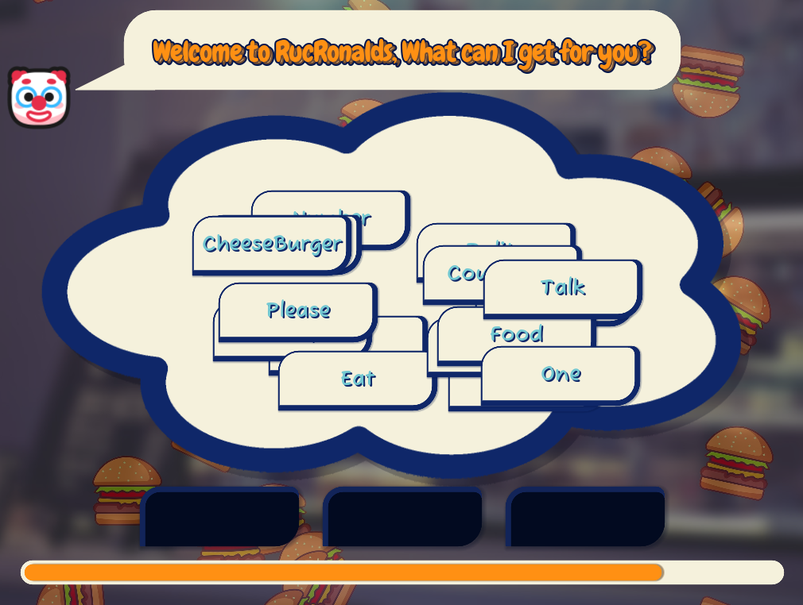
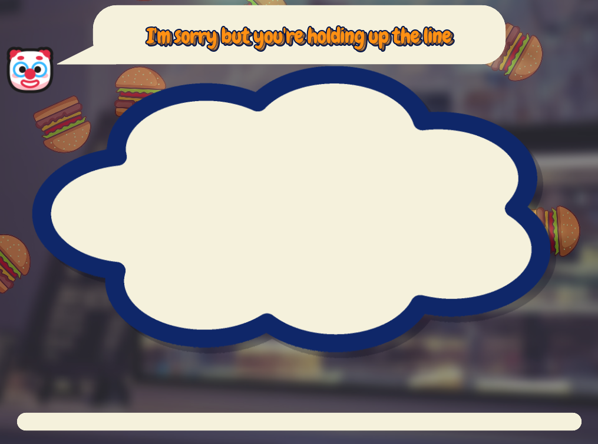

# Conversation Simulator
## Preview

## Play/Download
#### You can visit the itch.io page [here.](https://golden-rice.itch.io/conversation-simulator)

## About
*Conversation Simulator* is a game created in Godot 3.6 for the [20 Second Game Jam.](https://itch.io/jam/20-second-game-jam-2025) The game is a fast-paced puzzle word game, where you have 20 seconds to form sentences to get through a conversation. The idea was inspired by the experience of trying to find the right words to say during a conversation.